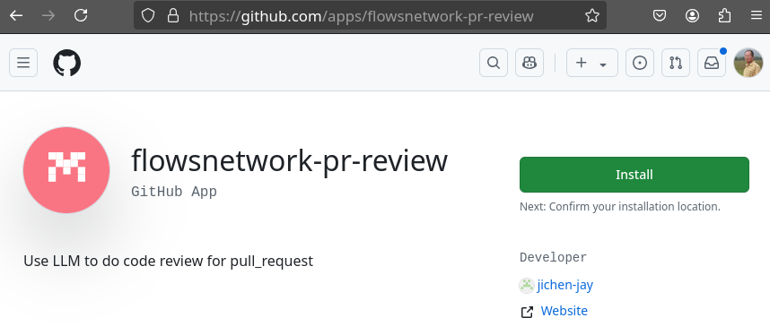
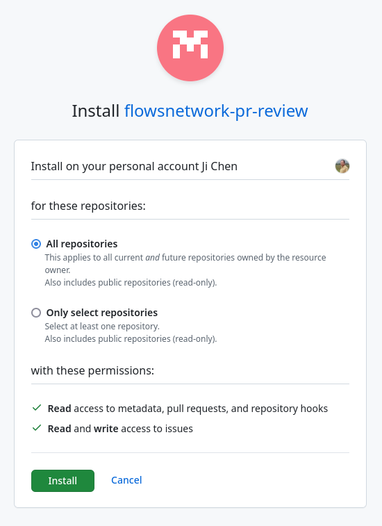
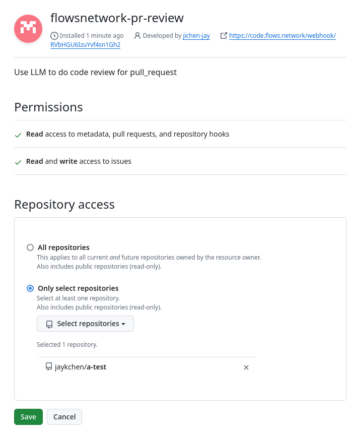
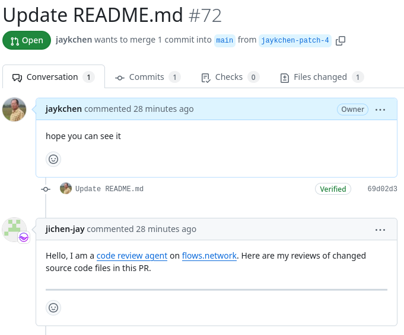
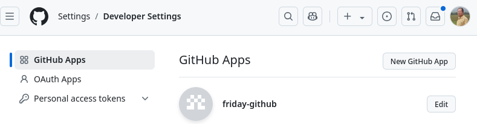
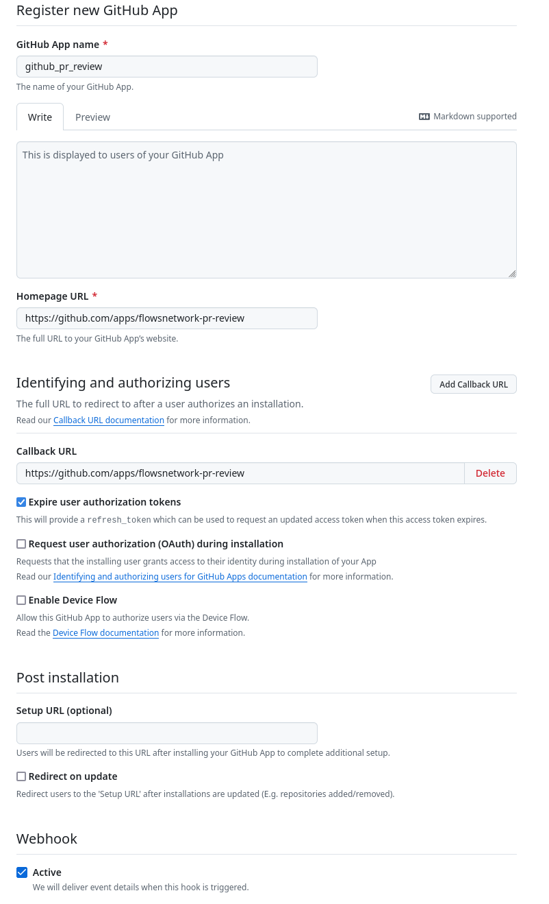
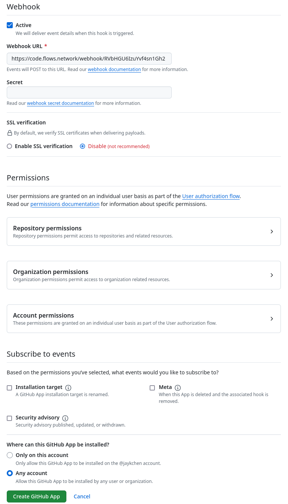
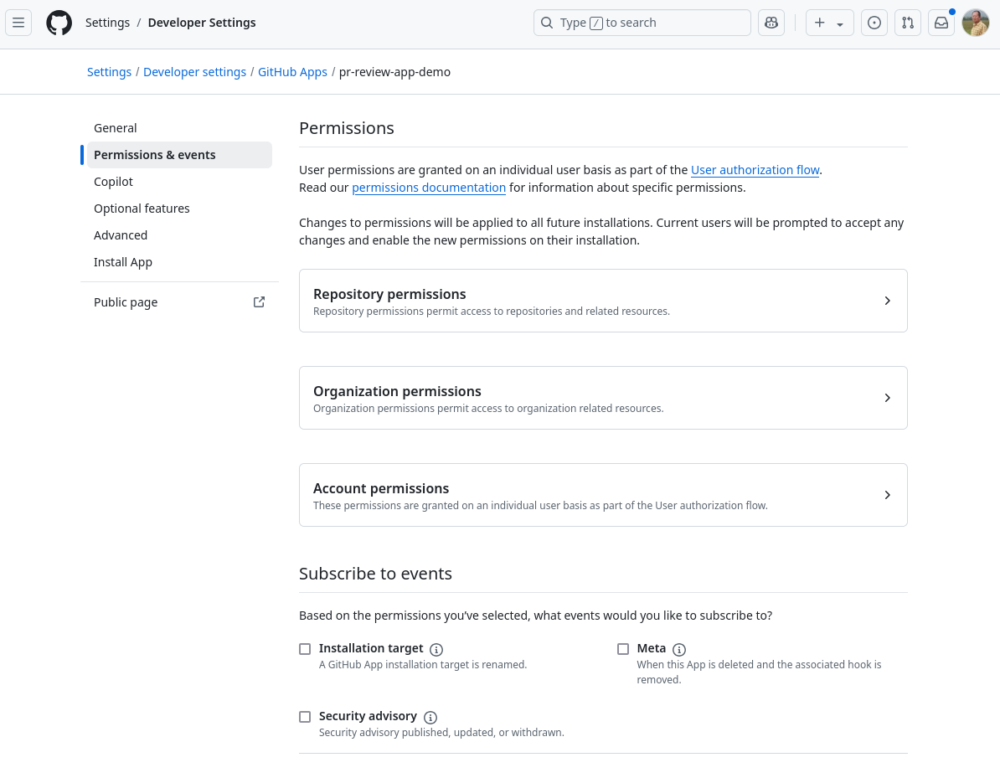

# GitHub Pull Request Code Review Bot

This project builds on [Agent to review code in Github PRs](https://github.com/flows-network/github-pr-review). The app watches the repository to which it has been installed for new Pull Request. When a new Pull Request is filed, it'll do a code review with LLM and post the report to the Pull Request as a comment.

## How to use

### Install the github app

- Go the GitHub App's [product page](https://github.com/apps/flowsnetwork-pr-review), as indicated below

.

- Install the app to your GitHub account 

- Select repositories to install as indicated below

- Select target repo 

The app is now ready to work. When a pull request is filed with your target repo, it will trigger the app, the review is done and the report is posted as a new comment on the pull request 

## How It Works

Here is a quick run-through of how this GitHub App is deployed:

- Create a new GitHub App

- Register the app and fill in details required

- Go through the permissions, make sure you give exact permissions needed, and avoid giving permissions more than needed

Now any GitHub user can install the GitHub App from its product page as shown at the top of the page.

## Behind the scences 

The heavy lifting work of this app is done by a serverless function hosted at [Flows.network](https://flows.network).

It receives the notification from GitHub (webhook payload) via the endpoint created at the time of the function's deployment. Its webhook url is registered with the GitHub App, as shown earlier.

