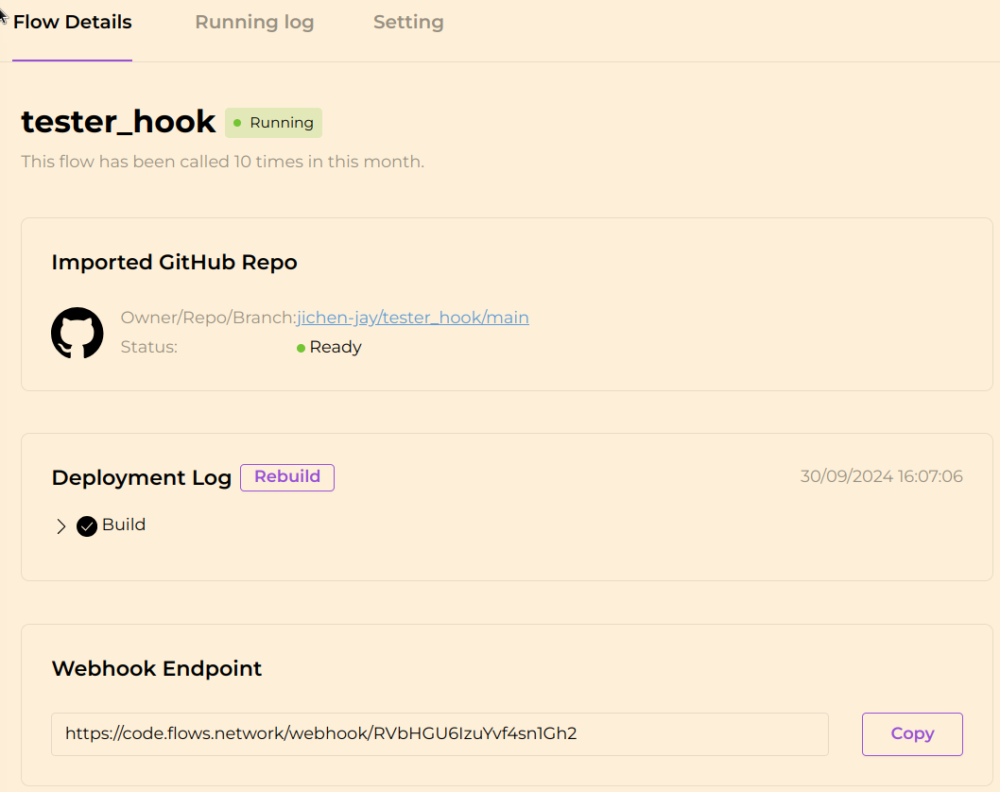

# GitHub Pull Request Code Review Bot

This project builds on [Agent to review code in Github PRs](https://github.com/flows-network/github-pr-review). It has been adapted to work with the **GitHub** platform, adding the following features:

1. **Webhook Integration**: The GitHub platform sends webhook data when a new Pull Request is created in a watched repository.
2. **Automated Review**: The review generated by the LLM (Large Language Model) is posted directly as a comment on the Pull Request.

## How It Works

To get this project up and running, follow these steps:

### 1. Deploy the Project on Flows.network

- Deploy the project on [Flows.network](https://flows.network).
- After deployment, you will receive a **Webhook URL**.

Please note that the code to run is located in the `github_pr_review` folder, put it in the `Directory` field in the table

### 2. Set Up Credentials

- Configure the necessary credentials for the project.

### 3. Configure Webhook in Your Repository

- In your repository settings on GitHub, set up a webhook to trigger on **Pull Request events**.
- Use the **Webhook URL** you obtained from Flows.network.

### 4. Automated Review Posting

- Once the Flows function reviews the Pull Request, the bot will automatically post the review as a comment on the Pull Request, similar to the example below:

---

### Additional Notes

- Ensure that the webhook is correctly configured to listen for **Pull Request events**.
- The bot will only post reviews for new Pull Requests after the webhook is set up.

---

By following these steps, you can automate the code review process for your GitHub repositories using the power of Flows.network and LLM-based reviews.
